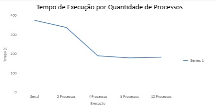
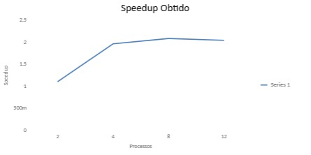
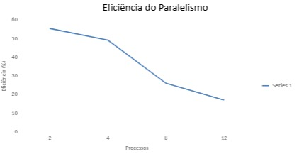

Sistema Distribuído de Detecção de Golpes e Fraudes nas transações

O sistema utiliza o dataset IEEE-CIS Fraud Detection para simular a análise de transações financeiras e detecção de possíveis fraudes em ambiente bancário.

Dataset Utilizado

-IEEE-CIS Fraud Detection

Tamanho aproximado: 1.35 GB

Fonte: Kaggle

-Objetivo

Implementar técnicas de processamento serial e paralelo para analisar grandes volumes de transações financeiras, medindo desempenho e ganho de eficiência.

-Tecnologias Utilizadas

Python

Pandas

CONFIGURAÇÃO DA MAQUINA UTILIZADA

| Item                        | Descrição                                |
| --------------------------- | ---------------------------------------- |
| Processador                 | Intel® Core™ i3-10110U CPU @ 2.10 GHz    |
| Número de núcleos           | 2 núcleos físicos / 4 threads lógicas    |
| Memória RAM                 | 12 GB DDR4 2667 MHz                      |
| Sistema Operacional         | Windows 11                               |
| Linguagem utilizada         | Python 3.14                              |
| Biblioteca de paralelização | concurrent.futures (ProcessPoolExecutor) |
| Compilador / Versão         | Python 3.14                              |

TEMPO SERIAL

A principio foi realizado um benchmark serial utilizando aproximadamente 200 mil transações do dataset.

-Resultados obtidos

-3 Execuções:

1° - 286,62 segundos

2° - 444,04 segundos

3° - 396,91 segundos

Tempo serial médio : 375,86 segundos

Aproximadamente 6 minutos e 16 segundos

| Execução        |  Tempo (s) |
| --------------- | ---------: |
| 1ª Execução     |     286,62 |
| 2ª Execução     |     444,04 |
| 3ª Execução     |     396,91 |
| **Tempo Médio** | **375,86** |

TEMPO PARALELO 

Após a execução serial, foi implementado o processamento paralelo utilizando a biblioteca ProcessPoolExecutor, o objetivo foi distribuir o processamento das transações entre múltiplos processos e comparar o desempenho obtido em diferentes níveis de paralelismo.

| Processos | Tempo (s) |
| --------- | --------: |
| 2         |    338,62 |
| 4         |    190,78 |
| 8         |    180,19 |
| 12        |    183,69 |

SPEEDUP

O speedup representa o ganho de desempenho obtido pela execução paralela em comparação com a execução serial.

| Processos | Tempo (s) | Speedup |
| --------- | --------: | ------: |
| 2         |    338,62 |    1,11 |
| 4         |    190,78 |    1,97 |
| 8         |    180,19 |    2,09 |
| 12        |    183,69 |    2,05 |

EFICIÊNCIA

A eficiência indica o nível de aproveitamento dos processos utilizados durante a execução paralela. Esse indicador permite avaliar o impacto do overhead de gerenciamento à medida que o número de processos aumenta.

| Processos | Speedup | Eficiência (%) |
| --------- | ------: | -------------: |
| 2         |    1,11 |          55,50 |
| 4         |    1,97 |          49,25 |
| 8         |    2,09 |          26,13 |
| 12        |    2,05 |          17,08 |

CONCLUSÃO

Os resultados demonstraram que a utilização de processamento paralelo proporcionou ganhos significativos de desempenho na análise das transações financeiras. O melhor resultado foi obtido com 8 processos, reduzindo o tempo de execução de 375,86 segundos para 180,19 segundos. A utilização de 12 processos apresentou desempenho ligeiramente inferior ao obtido com 8 processos, comportamento esperado devido ao overhead de gerenciamento dos processos e às limitações do hardware utilizado.

Alunos:

Breno Ferreira - 069800

Yuri Bacelar - 076605

