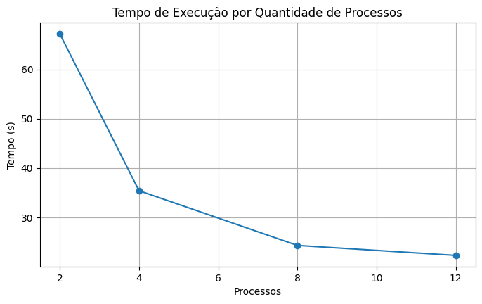
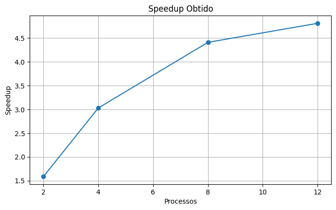
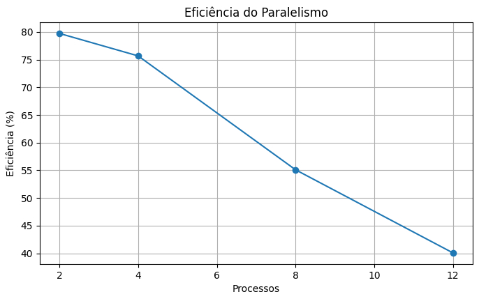

# Sistema Distribuído de Detecção de Golpes e Fraudes nas Transações

O sistema utiliza o dataset IEEE-CIS Fraud Detection para simular a análise de transações financeiras e detecção de possíveis fraudes em ambiente bancário.

---

## Dataset Utilizado

**IEEE-CIS Fraud Detection**

Tamanho aproximado: 1.35 GB

Fonte: Kaggle

---

## Objetivo

Implementar técnicas de processamento serial e paralelo para analisar grandes volumes de transações financeiras presentes no dataset IEEE-CIS Fraud Detection. O projeto tem como finalidade comparar o desempenho entre as abordagens, avaliando métricas como tempo de execução, speedup e eficiência, demonstrando os benefícios da computação paralela no processamento de grandes conjuntos de dados.
---

## Tecnologias Utilizadas

- Python
- Pandas

---

## Configuração da Máquina Utilizada

| Item | Descrição |
| --------------------------- | ---------------------------------------- |
| Processador | ...|
| Número de núcleos | .... |
| Memória RAM | .... |
| Sistema Operacional | ... |
| Linguagem utilizada | ... |
| Biblioteca de paralelização | concurrent.futures (ProcessPoolExecutor) |
| Compilador / Versão | Python 3.14 |

---

## Tempo Serial

Inicialmente foi realizado um benchmark serial utilizando aproximadamente 200 mil transações do dataset. Nesta abordagem, todas as transações são processadas sequencialmente, uma após a outra, utilizando apenas um fluxo de execução. O objetivo desta etapa foi estabelecer uma referência de desempenho para posterior comparação com a implementação paralela.

### Resultado Obtido

Tempo serial médio obtido durante a execução: 

| Execução | Tempo (s) |
| --------------- | ---------: |
| Execução | 107,21 |

O resultado demonstra o tempo necessário para processar todo o conjunto de dados sem a utilização de técnicas de paralelismo
---

## Tempo Paralelo

Após a execução serial, foi implementado o processamento paralelo utilizando a biblioteca ProcessPoolExecutor. Nesta abordagem, o conjunto de transações foi dividido em blocos e distribuído entre múltiplos processos.

O objetivo desta etapa foi avaliar o impacto do paralelismo na redução do tempo total de execução e verificar o ganho de desempenho obtido conforme o aumento da quantidade de processos.

| Processos | Tempo de Execução (s) |
| --------- | --------------------: |
| 2         |                 67,23 |
| 4         |                 35,42 |
| 8         |                 24,32 |
| 12        |                 22,29 |

  

---

## Speedup

O speedup representa o ganho de desempenho obtido pela execução paralela em comparação com a execução serial. Essa métrica permite quantificar quantas vezes a implementação paralela foi mais rápida do que a versão sequencial.

Observa-se abaixo que o aumento do número de processos proporcionou ganhos significativos de desempenho, atingindo um speedup máximo de 4,81 vezes em relação à execução serial.

| Processos | Tempo (s) | Speedup |
| --------- | --------: | ------: |
| 2         |     67,23 |    1,59 |
| 4         |     35,42 |    3,03 |
| 8         |     24,32 |    4,41 |
| 12        |     22,29 |    4,81 |

  

---

## Eficiência

A eficiência indica o grau de aproveitamento dos processos utilizados durante a execução paralela. Essa métrica considera a relação entre o speedup obtido e a quantidade de processos empregados, permitindo avaliar o impacto do overhead de gerenciamento e comunicação entre processos

Embora a eficiência diminua conforme aumenta o número de processos, esse comportamento é esperado devido aos custos adicionais de sincronização e gerenciamento do ambiente paralelo.

| Processos | Speedup | Eficiência (%) |
| --------- | ------: | -------------: |
| 2         |    1,59 |          79,73 |
| 4         |    3,03 |          75,67 |
| 8         |    4,41 |          55,10 |
| 12        |    4,81 |          40,08 |

  

---

## Conclusão

Os resultados obtidos demonstraram que a utilização de processamento paralelo proporcionou ganhos expressivos de desempenho na análise das transações financeiras. Enquanto a execução serial apresentou um tempo total de 107,21 segundos, a execução paralela utilizando 12 processos reduziu esse tempo para apenas 22,29 segundos.

O melhor resultado alcançou um speedup de 4,81 vezes em relação à implementação serial, evidenciando a eficiência das técnicas de paralelismo para o processamento de grandes volumes de dados. Os testes realizados confirmam que a divisão das tarefas entre múltiplos processos permite reduzir significativamente o tempo de execução, tornando a solução mais adequada para cenários que exigem alto desempenho computacional.

---

## Alunos

- Breno Ferreira - 069800
- Yuri Bacelar - 076605